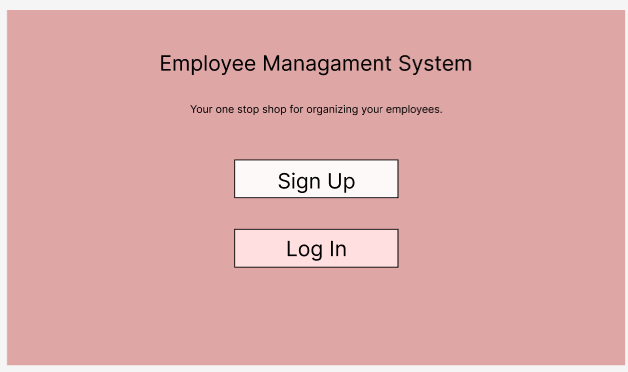
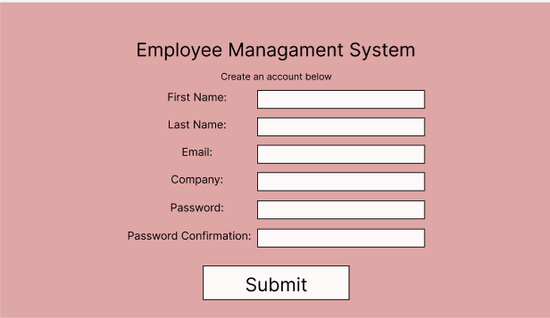
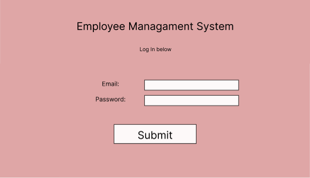
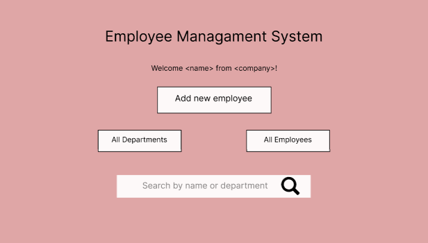
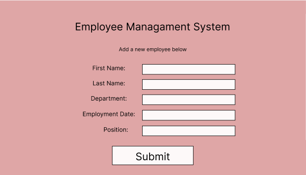
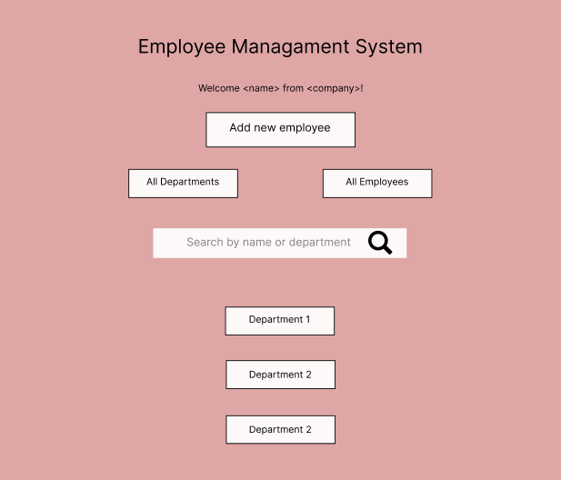

# Staffer
Staffer is a employee mangagement app designed to give employers one place to organize all their employee information.

Check out Staffer [here!](https://avongalie.github.io/Staffer/)

Visit my back-end repo [here.](https://github.com/avongalie/Staffer-API)

## User Stories
Employers should be able to:
* create an account
* sign in
* change their password
* sign out
* add employees
* update employee information
* remove employees
* search employees by name or department

## WireFrames

##### Homepage

##### Sign Up

##### Log In

##### Signed In Page

##### Add an employee

##### Search by name/department or all employees

##### All departments

## Technologies Used
* React.js
* HTML/CSS
* Bootstrap