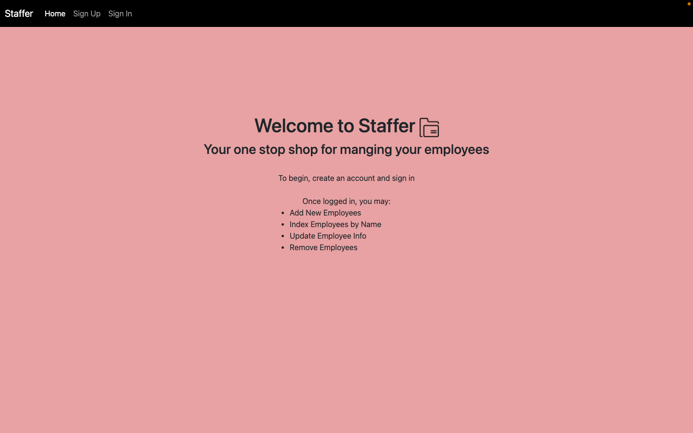

# Staffer
Staffer is a employee mangagement app designed to give employers one place to organize all their employee information.

Check out Staffer [here!](https://avongalie.github.io/Staffer/)

Visit my back-end repo [here.](https://github.com/avongalie/Staffer-API)

## User Stories
Employers should be able to:
* create an account
* sign in
* change their password
* sign out
* add employees
* update employee information
* remove employees
* search employees by name or department

## Installation and Contributions

Your help and feedback is welcomed and appreciated! If you'd like to contribute to this project, follow the steps below:

1. Fork and clone this repository.
1. Change into the new directory.
1. Use `git init` to initialize your Git repository. Then create and checkout to a new branch using `git checkout -b <branch name>`. 
1. Install dependencies with `npm install`.
1. Open in your code editor to make contributions (e.g. `code .` if using VSCode). To run the development server, use `npm start`.
1. When your contributions are ready for review, push to your clone with `git push origin <branch name>` and submit a pull request.

## Project Planning

Project Planning: [Wireframes](#wireframes) and ERD.
Workflow & Decision Making: Daily work flow checklists.
Problem Solving: Reviewed documentation, consulted 3rd party sites like w3schools.com, meet with TA's.

## WireFrames

##### Homepage

##### Sign Up

##### Log In

##### Signed In Page

##### Add an employee

##### Search by name/department or all employees

##### All departments

## Technologies Used
* React.js
* HTML/CSS
* Bootstrap

## Future Developments
* Employers should be able to see a running list of all departments under their account.
* Employers should be able to update their own account info other then just their password.